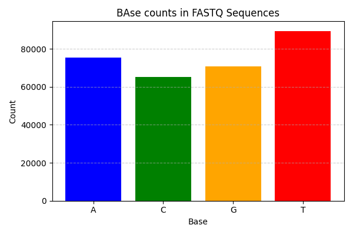

# **FASTQ Quality Analysis Tool**  

A Python-based bioinformatics tool designed for parsing, analyzing, and visualizing FASTQ sequencing data, including quality scores, GC content, and nucleotide frequency.  

## **Features**  
✅ **FASTQ Parsing** – Extract sequence and quality scores efficiently  
✅ **Read & Base Statistics** – Compute total reads, total bases, and average read length  
✅ **Quality Score Analysis** – Assess base accuracy and sequencing reliability  
✅ **GC Content Calculation** – Evaluate sequence stability based on GC percentage  
✅ **Nucleotide Frequency** – Count occurrences of A, C, G, and T bases  
✅ **Data Visualization** – Generate bar plots for nucleotide frequency representation  



https://github.com/Naman2d/Porfolio/blob/Bioinformatics_ExCD/output/Figure_1.png
## **Installation**  
```bash
git clone https://github.com/your-repo/fastq-quality-analysis-tool.git


